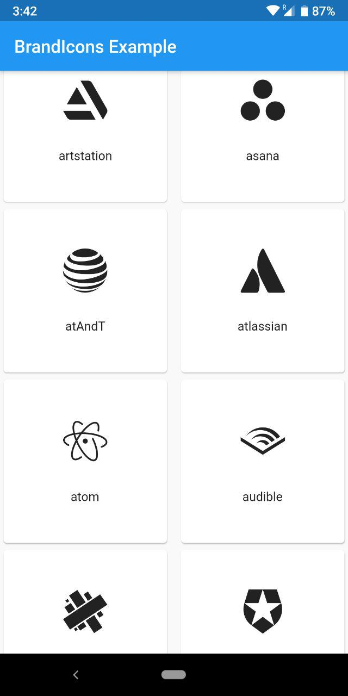

# flutter_brand_icons _v1.1.0_

## [See Catalog](https://simpleicons.org/)

## **Important Note**

Naming conventions have been changed for better readability and consistancy with all other flutter icon packs

To convert from the catalog simply follow this method

```
.NET => dotNet

Apple Pay => applepay
```

if still you face any problems have a look into the documentation (class BrandIcons), you could also checkout the [example app](https://pub.dev/packages/flutter_brand_icons#-example-tab-) for a comprehensive catalog with the proper naming system

## **655 Brand Icons for Flutter**

This Flutter package allows you to use all the [Brand Icons](https://simpleicons.org/) created by [Dan Leech](https://twitter.com/bathtype) and [others](https://github.com/orgs/simple-icons/people)

Find it at [pub.dartlang.org](https://pub.dev/packages/flutter_brand_icons)

## Installation

In the `dependencies:` section of your _pubspec.yaml_, add the following line:

```dart
flutter_brand_icons: <latest_version>
```

## Usage

```dart
import "package:flutter_brand_icons/flutter_brand_icons.dart";

class MyAwesomeWidget extends StatelessWidget {
  Widget build(BuildContext context) {
    return IconButton(
      icon: Icon(BrandIcons.github),
      onPressed: () {
          print("awesome platform to share code and ideas");
      }
    );
  }
}
```

## Example

View the flutter app in the `example` directory

## Screenshot


